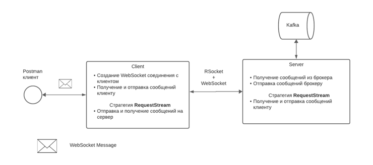

To run application run command:
  gradle clean build
 
 
First run server whick located in main branch, after run client (client branch)

 
 
To run zookeeper run command:
  bin/zookeeper-server-start.sh config/zookeeper.properties
 
 
To run kafka run command:
  bin/kafka-server-start.sh config/server.properties 

